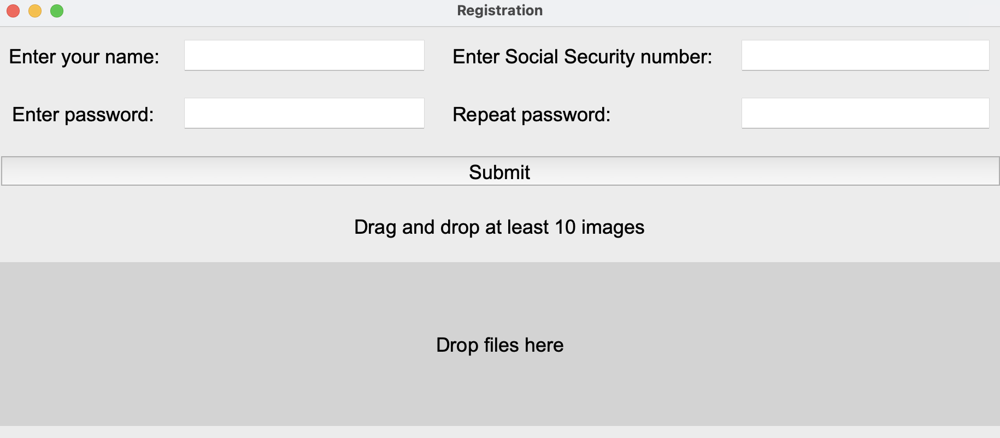
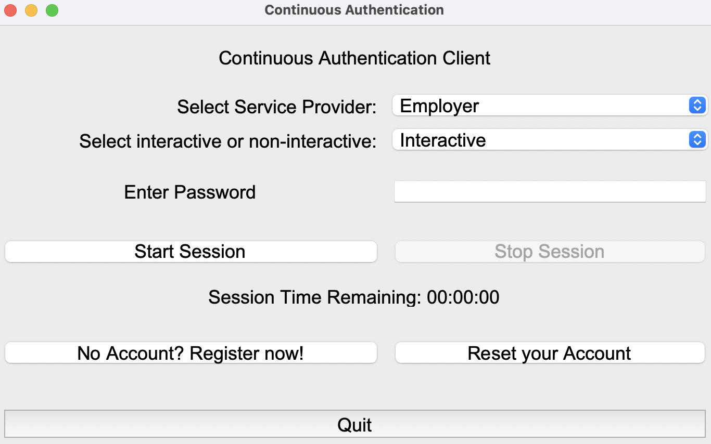

# User Interface

The client component is implemented as a Windows and MacOS application using Tkinter. The application provides two main functionalities for the user:

1. Account creation, which is registration with the enrolment protocol.
2. Initiating a continuous authentication session, corresponding to the authentication protocol.

The following two sections describe these functionalities in detail.

## Registration Function

The registration window, depicted in the [Registration Window](#Registration-Window), enables the user to execute the enrolment protocol with the IdP.

To initiate this process, the user must complete the registration form, which includes:

- Name  
- Password  
- Social Security number  
- A minimum of ten images, uploaded via a drag-and-drop field

Upon clicking the “Submit” button:

- A POST request is sent to the IdP server.
- The data is converted into JSON format for transmission.
- The client waits for a server response.

If successful:

- The returned JSON data is stored locally, as specified in the enrolment protocol.
- Two GET requests are triggered to download and save:
  - The encrypted classifier
  - The keystore

If unsuccessful:

- An error message is displayed in the client window.
- The user is required to resolve the issue and retry the process.

### Registration Window

## Authentication Function

If a user is already registered, they can initiate the continuous authentication session directly.  
The [Authentication Window](#Authentication-Window) illustrates the corresponding main window.

Steps:

1. The user selects the SP they intend to authenticate with.
2. Enters their password.
3. Chooses between interactive or non-interactive protocol via a drop-down menu.
4. Presses the “Start Session” button.

This sends a POST request to the selected SP, containing the data specified in the authentication protocol, transmitted in JSON format.

If the server responds successfully:

- All steps outlined in the authentication protocol are executed.
- Subsequent transmissions also occur exclusively via POST requests, formatted in JSON.
- In the current PoC, all steps are executed sequentially with a brief delay of two seconds between each.

However, the PoC does not incorporate any event-driven or frequency regulation mechanisms for continuous authentication.

The session can be terminated by:

- Pressing the “Quit” button
- The session timer expiring
- ZKP verification failing

### Authentication Window

---

# Flask Webservers

Both servers are built using the Python web framework Flask. Flask supports various HTTP endpoints through routing, which maps specific URLs to functions that handle client requests. Each route is associated with an HTTP method (e.g., `POST`, `GET`). Within each route, a function can be defined to receive, process, and transmit data, including HTTP status codes.
